# 📡 AI SIGNAL · 实时 AI 新闻聚合台

> **纯前端 · 零依赖 · 无服务器 · 无追踪 · 中英双语** —— 一个开着就能用的实时 AI 新闻信号台，由 GitHub Actions + GitHub Pages 驱动。

<p align="center">

[](https://josiahbristow.github.io/ai-signal/)
[](https://josiahbristow.github.io/ai-signal/)
[](https://github.com/JosiahBristow/ai-signal/actions/workflows/feeds.yml)
[](https://github.com/JosiahBristow/ai-signal/stargazers)
[](https://github.com/JosiahBristow/ai-signal/commits/main)
[](https://nodejs.org/)
[](https://developer.mozilla.org/zh-CN/docs/Web/HTML)

</p>

---

## 🎬 一图看懂

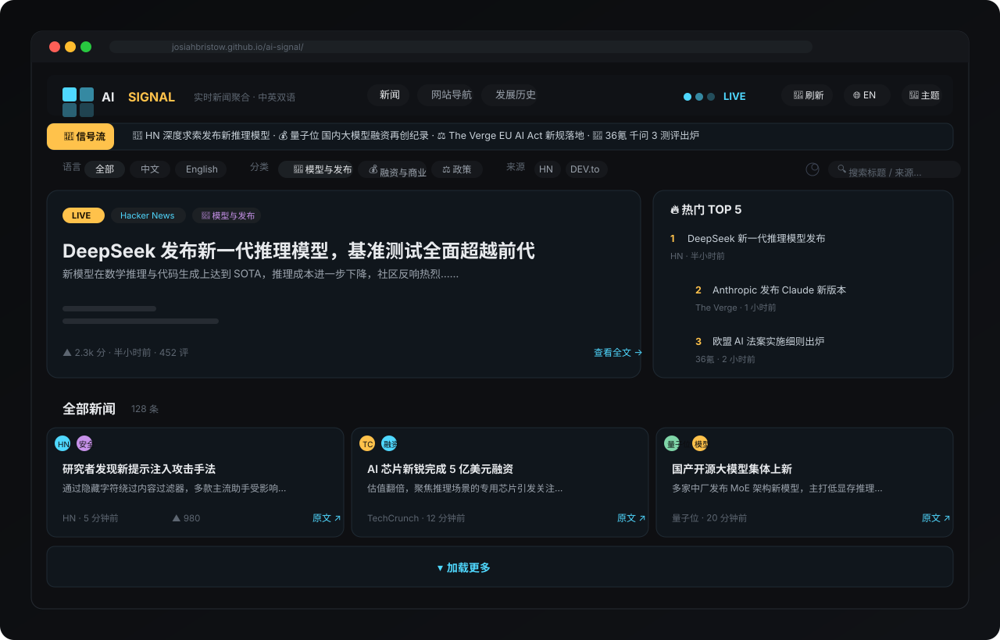

---

## 🧭 项目介绍

### 这是什么？

**AI SIGNAL** 是一个 **实时聚合中英文 AI 领域最新动态** 的新闻站，并附带两门自研教程课。它把散落在各个角落的 AI 信息 —— 英文科技媒体的 RSS、中文 AI 媒体的头条、Hacker News / DEV.to 的技术讨论 —— 汇聚成一个「信号台」：

- **📰 一个页面看全**：TechCrunch AI、The Verge AI、量子位、36氪、X 一线 AI 从业者动态、Hacker News、DEV.to，七大来源实时滚动。
- **🧠 自动分类**：模型发布 / 融资商业 / 政策监管 / 安全风险 / 芯片算力 / 机器人 / 研究 / 应用 / 其他，共 **9 大类** 免人工打标。
- **🔥 热度排名**：基于社区互动与新鲜度的加权信号强度，找出「此刻最该看的 TOP 5」。
- **📖 站内阅读**：全文快照本地渲染，不用跳走，断网也能看缓存内容。
- **📚 课程教程**：AI 基础 + Python 入门两门浓缩课，采用菜鸟教程式布局 —— 左侧章节目录（滚动高亮）+ 面包屑 + 上下章翻页 + 相关教程，代码块带语法高亮与一键复制。
- **📜 有图历史**：AI 发展时间线按阶段展示，点击每个阶段进入带插图的详解。
- **🌓 七套主题 + 中英双语**：晨报 / 午夜 / 极光 / 墨绿 / Mac 风格 / 极简(Suckless) / 跟随系统，一键即用。

### 📂 五大页面

| 页面 | Emoji | 说明 |
| --- | --- | --- |
| [`index.html`](index.html) | 📰 | 新闻首页：头条 / 热门 TOP5 / 信号流 / 卡片列表 / 站内阅读 |
| [`links.html`](links.html) | 🗺️ | AI 网站导航：对话模型 / 开源社区 / 资讯 / 研究 / 工具 |
| [`history.html`](history.html) | 📜 | AI 发展历史：五个阶段 + 插图详解 + 关键里程碑时间线 |
| [`learn.html`](learn.html) | 📚 | AI 基础：机器学习 / 训练评估 / 学习范式 / 深度学习，22 节数据驱动渲染 |
| [`python.html`](python.html) | 🐍 | Python 入门：基础语法 / 判断循环函数 / 数据容器 / 面向对象，22 节含 40 个高亮代码块 |

### ✨ 核心能力一览

| Emoji | 能力 | 说明 |
| --- | --- | --- |
| ⚡ | 实时聚合 | 每 5 分钟快照 + 每 5 分钟前端自动刷新，切回页面立即同步 |
| 🗂️ | 七大来源 | 5 个快照源（4 个 RSS/Atom + X 一线从业者 Bluesky 镜像）+ HN Algolia API + DEV.to API（浏览器直连） |
| 🧠 | 智能分类 | 标题 + 摘要关键词打分，9 大分类自动归类 |
| 🔥 | 热度算法 | 互动量（点赞/评论）与新鲜度加权，热榜即时刷新 |
| 📖 | 站内阅读 | `articles.json` 全文快照，服务端白名单消毒后渲染 |
| 💬 | 评论系统 | Giscus 接入 GitHub Discussions，无需自建后端 |
| 🌐 | 中英双语 | 全站 i18n 文案 + 按语言筛选新闻，互不影响 |
| 🎨 | 多主题 | 7 套视觉主题，localStorage 记忆，首屏前注入防闪烁 |
| 🔍 | 搜索筛选 | 关键词搜索 + 语言 / 分类 / 来源三维过滤 |
| 📚 | 课程教程 | 菜鸟教程式布局：左侧章节目录 + 滚动高亮 + 上下章翻页 + 相关教程 |
| 🖥️ | 代码高亮 | Python 教程内置正则分词高亮（关键字/字符串/注释/数字/内建函数） |
| 📋 | 一键复制 | 代码块一键复制，clipboard API + execCommand 双兜底 |
| 📜 | 阶段详解 | 历史页每阶段配插图，点击进入带概览与关键节点的详解 |
| 🗺️ | 网站导航 | 精选 AI 站点分类导航，图标多源降级加载 |

---

## 🎯 项目定位

### 解决了什么痛点？

1. **🚫 浏览器 CORS 限制** —— 浏览器无法直接抓取绝大多数 RSS 与网页全文。传统方案需要自建后端做代理，成本高、维护重。**AI SIGNAL 用「CI 服务端抓取 + 静态快照」绕开 CORS**，浏览器只做同源读取。
2. **☁️ 不想维护服务器** —— 纯静态站点托管在 GitHub Pages，**零服务器、零数据库、零追踪、零成本**。数据由 GitHub Actions 定时写入 Git 仓库，天然拥有版本历史与回滚能力。
3. **📚 信息太分散** —— 中文 AI 动态、英文科技新闻、社区讨论散落在不同平台。AI SIGNAL 把它们归一化进**同一条时间线**，并按语言 / 分类 / 来源自由切片。
4. **🎓 入门门槛高** —— AI 与 Python 的优质中文浓缩资料分散。两门课程按「课件 + 公开资料」整理成渐进式章节，数据驱动渲染，无需下载 PDF。

### 设计哲学

- 🗼 **快照优先**：CI 端抓取生成 JSON 快照 → 浏览器同源读取。快照是单一事实来源，缺了才回退。
- 🪶 **零依赖运行时**：站点本体是纯 HTML/CSS/JS，所有 Node 依赖只存在于 `scripts/` 构建期。
- 🛡️ **安全兜底**：全文一律服务端白名单消毒后才进 `innerHTML`；无快照时绝不在浏览器端代抓，只回退到新标签页。
- 💾 **Git 即数据库**：快照提交进仓库，历史内容有版本、可回滚、可审计。
- 📚 **数据即内容**：课程内容以 JS 数据（`PARTS` / `LESSONS`）形式驱动渲染，增删章节只需改数据。

### 与常见方案对比

| 方案 | 服务器 | 数据库 | CORS 规避 | 成本 | 全文阅读 |
| --- | --- | --- | --- | --- | --- |
| **AI SIGNAL（本项目）** | ❌ 无 | ❌ 无（Git 即库） | ✅ CI 快照 | 💸 免费 | ✅ 站内快照 |
| 自建后端聚合站 | ✅ 需要 | ✅ 需要 | ✅ | 💰 服务器费用 | ✅ |
| 浏览器直连 RSS | ❌ 无 | ❌ | ❌ 大多被 CORS 拦截 | 💸 免费 | ❌ 无 |
| 第三方聚合平台 | ❌ 无 | ❌ | ✅ | 🆓 免费但受制于人 | 视平台而定 |

---

## 📸 界面预览

### 课程页：菜鸟教程式布局

「AI 基础」与「Python 入门」采用教程排版 —— 左侧章节目录随滚动高亮当前节，顶部面包屑 + 标题卡，正文每课末尾带「上一章 / 下一章」翻页，右侧为相关教程：

<p align="center">
  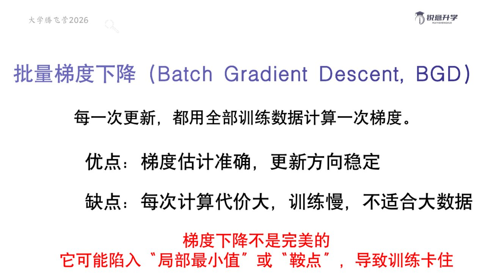
  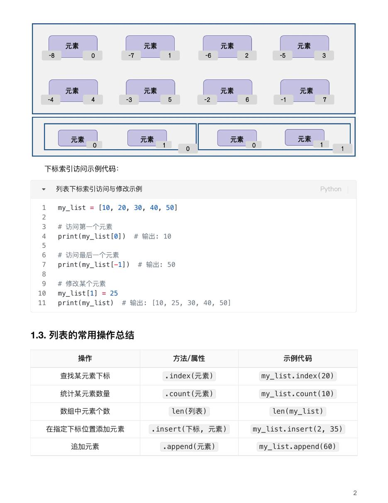
</p>

### 历史页：阶段详解

点击「思想萌芽 / 黄金时代 / 寒冬与专家系统 / 深度学习复兴 / 大模型时代」任一阶段，进入带插图的详解（概览 + 关键节点），下方时间线同步过滤：

<p align="center">
  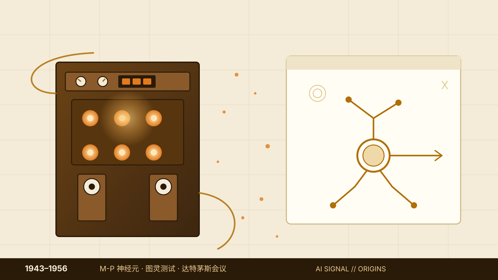
  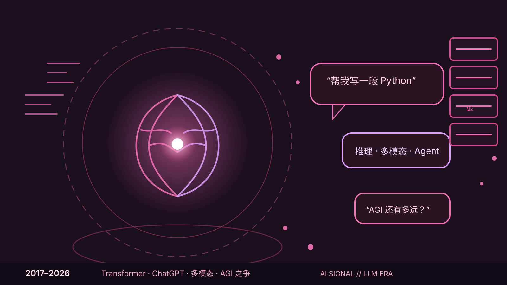
</p>

### 主题系统

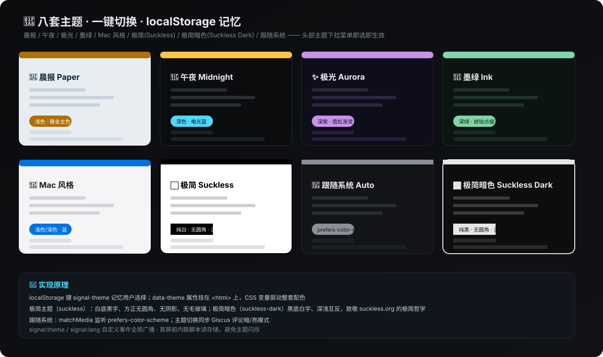

---

## 🧠 实现原理

### 1️⃣ 整体架构：四层流水线

```
数据源层 ──► 构建层(CI) ──► 存储层(GitHub) ──► 渲染层(浏览器)
```

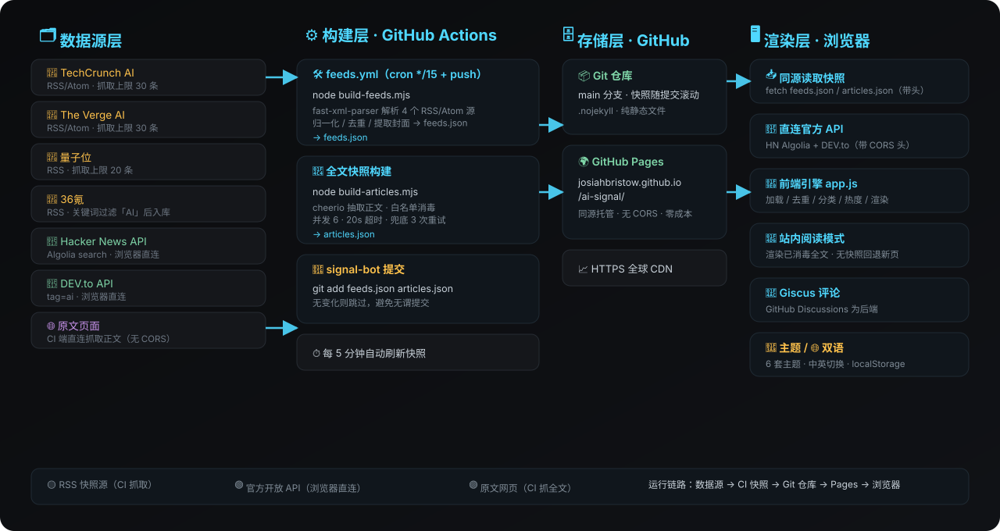

- **数据源层**：TechCrunch / The Verge / 量子位 / 36氪 的 RSS/Atom（CI 端抓取）；X 一线 AI 从业者动态（X 无免费 API，经 Bluesky 公共 AT 协议接口抓同一批从业者的镜像动态，CI 端抓取，来源标注为从业者账号）；Hacker News Algolia、DEV.to 的开放 API（浏览器端直连，自带 CORS 头）；原文网页（CI 端抓全文）。
- **构建层**：`feeds.yml`（每 5 分钟一轮，生成并提交 `feeds.json`）+ `articles.yml`（每 15 分钟一轮，生成并提交 `articles.json`）。
- **存储层**：GitHub 仓库 `main` 分支 + GitHub Pages 静态托管，`.nojekyll` 保证纯静态直接服务。
- **渲染层**：浏览器同源 `fetch` 快照，HN/DEV.to 直连官方 API，Giscus 走 iframe，全部无框架拼装。

### 2️⃣ 数据管道：快照优先，幂等写入

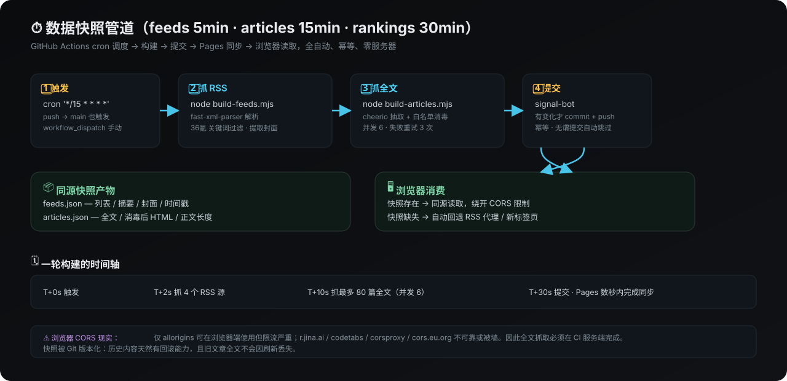

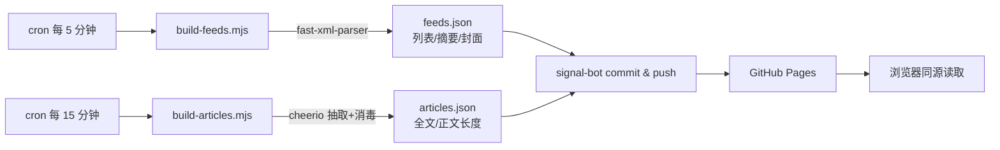

关键设计：

- **幂等**：新旧快照逐字节比对，**无变化则不提交**，避免制造空 commit。
- **并发与兜底**：全文抓取并发 6、20s 超时、3 次退避重试；单个源失败不影响整体。
- **历史保留**：滑出最新窗口的旧文章**沿用历史快照**，卡片不会随刷新丢失全文。
- **36氪 特殊处理**：全量 feed 用中文 AI 关键词表过滤后入库，保证每一条都「真·AI」。

### 3️⃣ 前端引擎（`app.js`）运行流程

`app.js` 是一个 IIFE 封装的状态机，核心链路：

```
加载快照 ──► 七大来源并行加载 ──► 合并 + URL 规范化去重
  ──► 热度打分 + 智能分类 ──► 渲染（头条/热榜/列表/ticker）
  ──► 每 5 分钟自动刷新 · 窗口聚焦立即同步
```

- **去重**：`urlKey()` 抹掉 hash 与 UTM 参数后比较 host + path，跨源同一篇文章只留一份（保留热度更高者）。
- **加载策略**：RSS 源优先读快照，快照缺失才走 `fetchRss()` 代理链（allorigins → codetabs，失败重试降级）。
- **懒渲染**：首屏 24 条，`加载更多` 每次 +18；骨架屏 + 来源健康状态提示。
- **ticker 信号流**：取最新 12 条双份拼接，CSS 动画无缝循环滚动。
- **站内阅读**：桌面端浮动窗口读全文，手机端卡片内联展开，点空白折叠；无快照自动回退新标签页。

### 4️⃣ 课程引擎（`learn.js` / `python.js`）

两门课共用一套数据驱动渲染：

```
PARTS（4 个部分）+ LESSONS（22 节 × 类型化 block）
  ──► 渲染：PART 分隔卡 + 课程卡片（p/table/callout/list/terms/fig/code）
  ──► 教程布局：左侧章节目录（按 PART 分组）+ scroll-spy 高亮 + 面包屑
  ──► 每课尾部「上一章 / 下一章」翻页，右侧「相关教程」面板
  ──► signal:lang 事件触发全量重渲染（中英双语）
```

- **block 类型**：`p` / `sub` / `list` / `terms` / `table` / `callout` / `fig` / `code`（仅 Python 课），均为 `{zh, en}` 双语数据。
- **滚动高亮**：`scroll` + `requestAnimationFrame` 节流，计算当前视口章节并高亮左侧目录、同步面包屑。
- **代码高亮**：`pyHighlight()` 正则分词，输出 `tok-k`（关键字）/ `tok-s`（字符串）/ `tok-c`（注释）/ `tok-n`（数字）/ `tok-b`（内建函数）/ `tok-d`（装饰器）六类 token，与七套主题 CSS 变量联动。
- **一键复制**：事件委托处理 `.l-code-copy`，优先 `navigator.clipboard`，失败回退 `execCommand`，按钮反馈「已复制 / 复制失败」。

### 5️⃣ 智能分类器：关键词打分

每条新闻以 **标题 + 摘要** 拼接后，对 9 个分类的预置关键词表做子串匹配，**第一个命中即归类**，全部未命中落入「其他」：

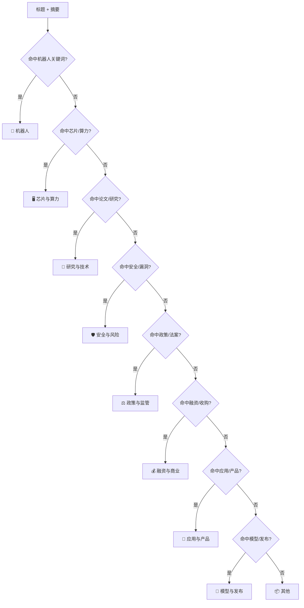

### 6️⃣ 热度算法：互动 × 新鲜度

每条新闻计算一个 `heat` 信号强度，驱动热榜与同文去重：

```
heat = 0.7 × (该源互动峰值归一化) + 0.3 × (新鲜度衰减)     # 有社区互动(HN/DEV.to)
heat = 0.15 × (新鲜度衰减)                                  # 无互动(RSS 快照)

互动值 = 点赞数 + 评论数 × 2
新鲜度  = max(0, 1 - 发布时长 / 72h)     # 3 天线性衰减至 0
```

社区活跃的 HN/DEV.to 新闻天然靠前；RSS 源按时间排序作为时间线的补充，避免被「刷屏热点」淹没。

### 7️⃣ 站内阅读与内容消毒

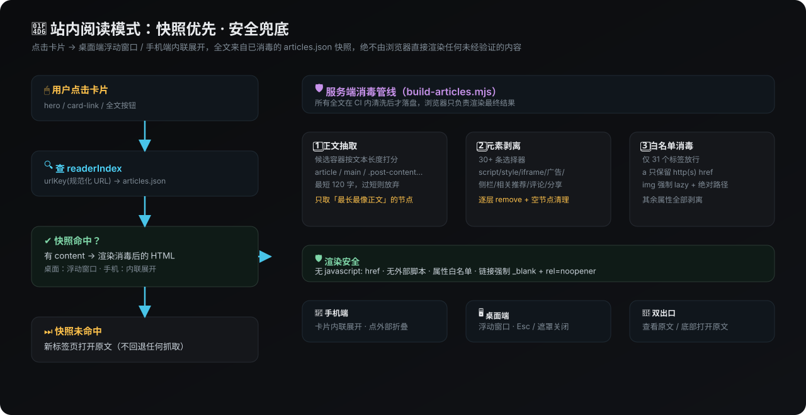

全文内容 **在 CI 服务端完成抽取 + 白名单消毒后才落盘**，浏览器端只负责把已清洗的 HTML 渲染进浮层：

| 步骤 | 手段 |
| --- | --- |
| 正文抽取 | 按候选容器文本长度打分，取「最长最像正文」的节点，最短 120 字 |
| 元素剥离 | 30+ 条选择器删掉 script/style/iframe/广告/侧栏/相关推荐/评论区 |
| 白名单消毒 | 仅 31 个标签放行；`a` 只保留 http(s) href 并强制 `_blank + rel=noopener`；`img` 强制 lazy + 绝对路径；其余属性全部剥离 |
| 空节点清理 | 无内容节点 / 纯装饰节点递归移除 |

> 🛡️ **安全底线**：绝不引入未验证的外部脚本，绝不保留 `javascript:` 链接，渲染结果只含干净的文本、链接与图片。

### 8️⃣ 主题系统与双语

- **主题**：`data-theme` 属性挂在 `<html>` 上，CSS 变量驱动整套配色。选择存 `localStorage`（`signal-theme`），且**在 `<head>` 内联脚本首屏前读回**，杜绝主题闪烁。`auto` 主题通过 `matchMedia` 监听系统深浅色。
- **极简主题**：致敬 suckless.org 的「极简」主题 —— 白底黑字、方正无圆角、无阴影、无毛玻璃，可用 `data-theme="suckless"` 单独启用。
- **双语**：`common.js` 内置全站 i18n 词表，`window.t()` 统一翻译，`data-i18n` 标记批量应用；语言切换通过 `signal:lang` 自定义事件广播，Giscus 评论语言与主题同步跟随。
- **事件总线**：主题、语言、刷新均以 `CustomEvent` 广播，模块间低耦合。

### 9️⃣ 导航页图标降级

导航页 28 个站点图标默认请求 Google favicon 服务；不可达时自动探测 Fastly → DuckDuckGo → favicon.im，全部失败则回退为**首字母占位图标**，任何网络环境下都能正常显示。

---

## 🗂️ 目录结构

```
.
├── 📄 index.html            # 新闻首页（头条/热榜/列表/阅读模式）
├── 📄 links.html            # AI 网站导航
├── 📄 history.html          # AI 发展历史（阶段详解 + 时间线）
├── 📄 learn.html            # AI 基础课程（菜鸟教程式布局）
├── 📄 python.html           # Python 入门课程（菜鸟教程式布局）
├── 🎨 styles.css            # 七套主题设计系统 + 教程布局（CSS 变量）
├── ⚙️ common.js             # 主题切换 / 导航 / 双语 i18n
├── 🧠 app.js                # 新闻引擎（加载/去重/分类/热度/渲染/阅读/评论）
├── 📚 learn.js              # AI 基础课程数据 + 渲染引擎
├── 🐍 python.js             # Python 课程数据 + 渲染引擎（含代码高亮/复制）
├── 📦 feeds.json            # RSS + X 从业者快照（CI 每 5 分钟生成）
├── 📦 articles.json         # 全文快照（CI 生成，已消毒）
├── 🖼️ favicon.svg + icons/  # 站点图标（多尺寸）
├── 🖼️ images/               # 历史页阶段插图（SVG）+ 课程配图（learn/、python/）
├── 📚 docs/                 # README 配图（架构/管道/阅读/主题/首页 SVG 图）
├── 🤖 .github/workflows/feeds.yml  # 定时构建 + 自动提交
└── 📦 scripts/
    ├── build-feeds.mjs      # RSS 快照 + X 从业者 Bluesky 镜像构建（fast-xml-parser）
    ├── build-articles.mjs   # 全文快照构建（cheerio 抽取+消毒）
    └── package.json         # 仅构建期依赖（运行时零依赖）
```

---

## 🚀 快速开始

```bash
# ① 克隆仓库
git clone git@github.com:JosiahBristow/ai-signal.git
cd ai-signal

# ② 安装脚本依赖（Node 20+）
cd scripts && npm install

# ③ 构建 RSS 快照
node build-feeds.mjs

# ④ 构建全文快照
node build-articles.mjs

# ⑤ 语法检查
cd ..
node --check app.js common.js history.js learn.js python.js scripts/*.mjs
```

> 🖥️ 本地预览直接用任意静态服务器，例如 `python3 -m http.server`。

---

## 🌐 部署（GitHub Pages）

1. 📤 推送到仓库 `main` 分支。
2. ⚙️ **Settings → Pages → Source: Deploy from a branch → `main` / `/(root)`**。
3. ⏳ 等待几分钟，访问 `https://<username>.github.io/<repo>/`。

仓库已包含 `.nojekyll`，Pages 直接以纯静态方式服务；`feeds.yml` 会在 **push 与每 5 分钟定时** 自动刷新并提交快照，`articles.yml` 每 15 分钟刷新全文快照。

---

## ⚙️ 配置

| 配置项 | 位置 | 说明 |
| --- | --- | --- |
| 💬 Giscus 评论 | `app.js` 顶部 `GISCUS` | 填入 `repo` / `repoId` / `category` / `categoryId` 后启用，未配置时显示友好提示 |
| 📡 数据源 | `app.js` 的 `SOURCES` + `scripts/build-feeds.mjs` 的 `FEEDS` / `X_ACCOUNTS` | 增删 RSS 源、X 从业者账号、关键词过滤、抓取上限 |
| 🧠 分类关键词 | `app.js` 的 `CATEGORIES` | 每个分类的 `kw` 数组，命中即归类 |
| 📚 课程内容 | `learn.js` 的 `LESSONS` / `PARTS`、`python.js` 的 `LESSONS` / `PARTS` | 每节为 `{part, no, zh, en, hue, tags, lead, blocks}` 双语数据，改数据即改课程 |
| 🎨 主题 | `common.js` + `styles.css` | CSS 变量与主题列表，新增主题只需加一个 `data-theme` 分支 |
| 🌐 文案 | `common.js` 的 `I18N` | 中英词表，`zh`/`en` 字段 |
| 📜 历史阶段 | `history.js` 的 `ERAS` / `DETAILS` / `ITEMS` | 阶段、详解文案与时间线条目，均为中英双语数据 |
| 🖼️ 阶段插图 | `images/history-*.svg` | 每个阶段一张配图，替换 `DETAILS` 中的 `img` 路径即可 |

---

## 🛠️ 技术栈

| 类别 | 选型 |
| --- | --- |
| 运行时 | 纯 HTML / CSS / JavaScript，无框架、无构建步骤 |
| 课程渲染 | 数据驱动（`PARTS` / `LESSONS`），正则分词代码高亮 + clipboard API |
| CI 构建（Node 20+） | `fast-xml-parser`（RSS/Atom 解析）、`cheerio`（全文抽取与消毒） |
| 数据源 | RSS/Atom 快照 + Hacker News / DEV.to 官方 API |
| 托管 | GitHub Actions + GitHub Pages（`.nojekyll` 纯静态） |
| 评论 | Giscus（GitHub Discussions） |

---

## 📄 免责声明

> 📚 本站仅聚合链接与摘要，所有内容版权归原网站所有。全文快照用于站内阅读，请以 **5 分钟快照周期内** 的原文为准。
>
> 🔗 导航页收录的均为公开资源，跳转行为发生在原网站，本站不承担由此产生的内容责任。
>
> 📖 课程页内容根据公开教学资料整理，仅供学习使用；配图来源标注见各页图注。

---

<p align="center">
  <b>📡 SIGNAL // RECEIVING FREQUENCY</b><br/>
  <sub>纯前端 · 零依赖 · 无服务器 · 无追踪 —— 由 GitHub Actions + GitHub Pages 驱动</sub>
</p>
